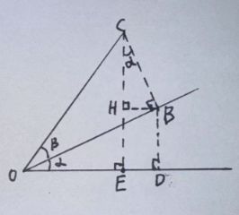

# Trigonometry

$$
\cos(\alpha + \beta) = \frac{OE}{OC}
$$
$$
OE = OD - ED
$$
$$
ED = HB
$$
$$
\begin{align*}
\cos(\alpha) &= \frac{OD}{OB} \\
OB\cos(\alpha) &= OD
\end{align*}
$$
$$
\begin{align*}
\cos(\beta) &= \frac{OB}{OC} \\
OB\ &= OC\cos(\beta)
\end{align*}
$$
$$
\begin{align*}
OC\cos(\beta)\cos(\alpha) &= OD
\end{align*}
$$
$$
\begin{align*}
\cos(\alpha) &= \frac{HB}{CB} \\
CB\cos(\alpha) &= ED
\end{align*}
$$
$$
\begin{align*}
\sin(\beta) &= \frac{CB}{OC} \\
CB &= OC\sin(\beta)
\end{align*}
$$
$$
OC\sin(\beta)\cos(\alpha) = ED
$$
$$
\begin{align*}
\cos(\alpha + \beta) &= \frac{OC\cos(\beta)\cos(\alpha) - OC\sin(\beta)\cos(\alpha)}{OC} \\
&= \cos(\alpha)\cos(\beta) - \sin(\alpha)\cos(\beta) \\
\end{align*}
$$
---
$$
\sin(\alpha + \beta) = \frac{CE}{OC}
$$
$$
CE = CH + HE
$$
$$
CH = CB\cos(\alpha)
$$
$$
CB = OC\sin(\beta)
$$
$$
CH = OC\sin(\beta)\cos(\alpha)
$$
$$
HE = BD = OB\sin(\alpha)
$$
$$
OB = OC\cos(\beta)
$$
$$
HE = OC\cos(\beta)\sin(\alpha)
$$
$$
\begin{align*}
\sin(\alpha + \beta) &= \frac{OC\sin(\beta)\cos(\alpha) + OC\cos(\beta)\sin(\alpha)}{OC} \\
&= \sin(\alpha)\cos(\beta) + \cos(\alpha)\sin(\beta)
\end{align*}
$$